# Complete Action Cycle - VPD Sensing to Device Actions

## Overview

This document details the complete action cycle from VPD sensor readings through decision-making to device control actions for VPD-Perfection, VPD-Target, and Drying control modes.

## VPD Sensing Pipeline

### 1. Sensor Data Collection

```python
# OGBVPDManager.handle_new_vpd() - Triggered by "VPDCreation" event
async def handle_new_vpd(self, data):
    """Process new VPD sensor data and trigger mode-specific actions."""

    # 1. Validate control permissions
    controlOption = self.data_store.get("mainControl")
    if controlOption not in ["HomeAssistant", "Premium"]:
        return

    # 2. Get available sensor devices
    devices = self.data_store.get("devices")
    if not devices:
        _LOGGER.warning(f"NO Sensors Found to calc VPD in {self.room}")
        return

    # 3. Extract temperature and humidity sensor readings
    temperatures = []
    humidities = []

    for device in devices:
        if isinstance(device, Sensor) and device.isInitialized:
            air_sensors = device.getSensorsByContext("air")

            # Collect temperature readings
            if "temperature" in air_sensors:
                for temp_sensor in air_sensors["temperature"]:
                    try:
                        value = float(temp_sensor.get("state"))
                        temperatures.append({
                            "entity_id": temp_sensor.get("entity_id"),
                            "value": value,
                            "label": temp_sensor.get("label")
                        })
                    except (ValueError, TypeError) as e:
                        _LOGGER.error(f"Invalid temperature value: {e}")

            # Collect humidity readings
            if "humidity" in air_sensors:
                for hum_sensor in air_sensors["humidity"]:
                    try:
                        value = float(hum_sensor.get("state"))
                        humidities.append({
                            "entity_id": hum_sensor.get("entity_id"),
                            "value": value,
                            "label": hum_sensor.get("label")
                        })
                    except (ValueError, TypeError) as e:
                        _LOGGER.error(f"Invalid humidity value: {e}")

    # 4. Store raw sensor data
    self.data_store.setDeep("workData.temperature", temperatures)
    self.data_store.setDeep("workData.humidity", humidities)
```

### 2. VPD Calculation

```python
# Calculate average values and VPD
avgTemp = calculate_avg_value(temperatures)
avgHum = calculate_avg_value(humidities)
avgDew = calculate_dew_point(avgTemp, avgHum)

# Store averaged environmental data
self.data_store.setDeep("tentData.temperature", avgTemp)
self.data_store.setDeep("tentData.humidity", avgHum)
self.data_store.setDeep("tentData.dewpoint", avgDew)

# Get leaf temperature offset for VPD calculation
leafTempOffset = self.data_store.getDeep("tentData.leafTempOffset") or 0.0

# Calculate current VPD
currentVPD = calculate_current_vpd(avgTemp, avgHum, leafTempOffset)

# Store current VPD
lastVpd = self.data_store.getDeep("vpd.current")
if currentVPD != lastVpd:
    self.data_store.setDeep("vpd.current", currentVPD)

    # Publish VPD data to HA sensors
    vpdPub = OGBVPDPublication(
        Name=self.room,
        VPD=currentVPD,
        AvgTemp=avgTemp if avgTemp != "unavailable" else None,
        AvgHum=avgHum if avgHum != "unavailable" else None,
        AvgDew=avgDew if avgDew != "unavailable" else None
    )
    await update_sensor_via_service(self.room, vpdPub, self.hass)
```

### 3. Mode Selection and Action Triggering

```python
# Emit mode run event to trigger control actions
tentMode = self.data_store.get("tentMode")
runMode = OGBModeRunPublication(currentMode=tentMode)

# Trigger mode-specific action selection
await self.event_manager.emit("selectActionMode", runMode)
```

## VPD-Perfection Mode Action Cycle

### 1. Mode Handler Entry

```python
# OGBModeManager.handle_vpd_perfection()
async def handle_vpd_perfection(self):
    """VPD Perfection mode - maintain optimal VPD range for plant stage."""

    # Get current VPD values
    currentVPD = self.data_store.getDeep("vpd.current")
    perfectionVPD = self.data_store.getDeep("vpd.perfection")      # Target VPD
    perfectionMinVPD = self.data_store.getDeep("vpd.perfectMin")   # Minimum acceptable
    perfectionMaxVPD = self.data_store.getDeep("vpd.perfectMax")   # Maximum acceptable

    # Validate all values are available
    if any(val is None for val in [currentVPD, perfectionMinVPD, perfectionMaxVPD, perfectionVPD]):
        _LOGGER.warning(f"{self.room}: VPD values not initialized. Skipping VPD control.")
        return

    # Get device capabilities for action generation
    capabilities = self.data_store.getDeep("capabilities")
```

### 2. VPD Range Comparison and Action Selection

```python
# Determine action based on VPD position relative to target range
if currentVPD < perfectionMinVPD:
    # VPD too low - increase VPD (reduce humidity/increase temperature)
    _LOGGER.debug(f"{self.room}: VPD {currentVPD} below min {perfectionMinVPD}. Increasing VPD.")
    await self.event_manager.emit("increase_vpd", capabilities)

elif currentVPD > perfectionMaxVPD:
    # VPD too high - decrease VPD (increase humidity/decrease temperature)
    _LOGGER.debug(f"{self.room}: VPD {currentVPD} above max {perfectionMaxVPD}. Reducing VPD.")
    await self.event_manager.emit("reduce_vpd", capabilities)

elif currentVPD != perfectionVPD:
    # VPD within range but not at optimal - fine tune
    _LOGGER.debug(f"{self.room}: VPD {currentVPD} within range but not at perfection {perfectionVPD}. Fine-tuning.")
    await self.event_manager.emit("FineTune_vpd", capabilities)

else:
    # VPD at perfection - no action needed
    _LOGGER.debug(f"{self.room}: VPD {currentVPD} is at perfection {perfectionVPD}. No action required.")
```

### 3. VPD Action Processing

#### Increase VPD Actions (reduce humidity/increase temperature)

```python
# OGBVPDActions.increase_vpd() - Triggered by "increase_vpd" event
async def increase_vpd(self, capabilities: Dict[str, Any]):
    """Generate actions to increase VPD by adjusting environmental controls."""

    vpd_light_control = self.ogb.dataStore.getDeep("controlOptions.vpdLightControl")
    action_message = "VPD-Increase Action"

    action_map = []

    # Exhaust fan - increase airflow to remove moisture
    if capabilities.get("canExhaust", {}).get("state"):
        action_map.append(self._create_action("canExhaust", "Increase", action_message))

    # Intake fan - reduce intake to create negative pressure
    if capabilities.get("canIntake", {}).get("state"):
        action_map.append(self._create_action("canIntake", "Reduce", action_message))

    # Ventilation - increase air exchange
    if capabilities.get("canVentilate", {}).get("state"):
        action_map.append(self._create_action("canVentilate", "Increase", action_message))

    # Humidifier - reduce humidity (turn off if running)
    if capabilities.get("canHumidify", {}).get("state"):
        action_map.append(self._create_action("canHumidify", "Reduce", action_message))

    # Dehumidifier - increase dehumidification
    if capabilities.get("canDehumidify", {}).get("state"):
        action_map.append(self._create_action("canDehumidify", "Increase", action_message))

    # Heater - increase temperature (raises VPD)
    if capabilities.get("canHeat", {}).get("state"):
        action_map.append(self._create_action("canHeat", "Increase", action_message))

    # Cooler - reduce cooling (allows temperature to rise)
    if capabilities.get("canCool", {}).get("state"):
        action_map.append(self._create_action("canCool", "Reduce", action_message))

    # Climate control - evaluate and adjust
    if capabilities.get("canClimate", {}).get("state"):
        action_map.append(self._create_action("canClimate", "Eval", action_message))

    # CO2 - increase CO2 (can affect plant transpiration)
    if capabilities.get("canCO2", {}).get("state"):
        action_map.append(self._create_action("canCO2", "Increase", action_message))

    # Optional: Light control for VPD
    if vpd_light_control and capabilities.get("canLight", {}).get("state"):
        action_map.append(self._create_action("canLight", "Increase", action_message))

    # Send to action manager for processing
    await self.action_manager.checkLimitsAndPublicate(action_map)
```

#### Reduce VPD Actions (increase humidity/decrease temperature)

```python
# OGBVPDActions.reduce_vpd() - Triggered by "reduce_vpd" event
async def reduce_vpd(self, capabilities: Dict[str, Any]):
    """Generate actions to decrease VPD by adjusting environmental controls."""

    action_message = "VPD-Reduce Action"
    action_map = []

    # Humidifier - increase humidity
    if capabilities.get("canHumidify", {}).get("state"):
        action_map.append(self._create_action("canHumidify", "Increase", action_message))

    # Dehumidifier - reduce dehumidification
    if capabilities.get("canDehumidify", {}).get("state"):
        action_map.append(self._create_action("canDehumidify", "Reduce", action_message))

    # Heater - reduce heating
    if capabilities.get("canHeat", {}).get("state"):
        action_map.append(self._create_action("canHeat", "Reduce", action_message))

    # Cooler - increase cooling
    if capabilities.get("canCool", {}).get("state"):
        action_map.append(self._create_action("canCool", "Increase", action_message))

    # Exhaust fan - reduce airflow
    if capabilities.get("canExhaust", {}).get("state"):
        action_map.append(self._create_action("canExhaust", "Reduce", action_message))

    # Intake fan - increase intake
    if capabilities.get("canIntake", {}).get("state"):
        action_map.append(self._create_action("canIntake", "Increase", action_message))

    # Send to action manager
    await self.action_manager.checkLimitsAndPublicate(action_map)
```

## VPD-Target Mode Action Cycle

### 1. Mode Handler Entry

```python
# OGBModeManager.handle_targeted_vpd()
async def handle_targeted_vpd(self):
    """VPD Target mode - maintain user-defined VPD target with tolerance."""

    _LOGGER.info(f"ModeManager: {self.room} Modus 'Targeted VPD' aktiviert.")

    try:
        # Get VPD control values
        currentVPD_raw = self.data_store.getDeep("vpd.current")
        targetedVPD_raw = self.data_store.getDeep("vpd.targeted")  # User-set target
        tolerance_raw = self.data_store.getDeep("vpd.tolerance")   # Tolerance percentage

        # Validate all values are available
        if any(val is None for val in [currentVPD_raw, targetedVPD_raw, tolerance_raw]):
            _LOGGER.warning(f"{self.room}: VPD values not initialized. Skipping VPD control.")
            return

        # Convert to numeric values
        currentVPD = float(currentVPD_raw)
        targetedVPD = float(targetedVPD_raw)
        tolerance_percent = float(tolerance_raw)  # 1-25%

        # Calculate tolerance range
        tolerance_value = targetedVPD * (tolerance_percent / 100)
        min_vpd = targetedVPD - tolerance_value
        max_vpd = targetedVPD + tolerance_value

        # Get device capabilities
        capabilities = self.data_store.getDeep("capabilities")
```

### 2. Target-Based Action Selection

```python
# Determine action based on position relative to target range
if currentVPD < min_vpd:
    # Below minimum tolerance - increase VPD
    _LOGGER.debug(f"{self.room}: VPD {currentVPD} below min tolerance {min_vpd}. Increasing VPD.")
    await self.event_manager.emit("increase_vpd", capabilities)

elif currentVPD > max_vpd:
    # Above maximum tolerance - decrease VPD
    _LOGGER.debug(f"{self.room}: VPD {currentVPD} above max tolerance {max_vpd}. Reducing VPD.")
    await self.event_manager.emit("reduce_vpd", capabilities)

elif currentVPD != targetedVPD:
    # Within tolerance but not at exact target - fine tune
    _LOGGER.debug(f"{self.room}: VPD {currentVPD} within tolerance but not at target {targetedVPD}. Fine-tuning.")
    await self.event_manager.emit("FineTune_vpd", capabilities)

else:
    # At exact target - no action needed
    _LOGGER.debug(f"{self.room}: VPD {currentVPD} is at target {targetedVPD}. No action required.")
    return
```

## Drying Mode Action Cycle

### 1. Drying Mode Handler Entry

```python
# OGBModeManager.handle_drying()
async def handle_drying(self):
    """Drying mode - specialized environmental control for harvest/drying."""

    currentDryMode = self.data_store.getDeep("drying.currentDryMode")

    # Initialize drying start time if needed
    mode_start_time = self.data_store.getDeep("drying.mode_start_time")
    if mode_start_time is None and currentDryMode != "NO-Dry":
        self.start_drying_mode(currentDryMode)

    # Route to specific drying method
    if currentDryMode == "ElClassico":
        phaseConfig = self.data_store.getDeep(f"drying.modes.{currentDryMode}")
        await self.handle_ElClassico(phaseConfig)

    elif currentDryMode == "DewBased":
        phaseConfig = self.data_store.getDeep(f"drying.modes.{currentDryMode}")
        await self.handle_DewBased(phaseConfig)

    elif currentDryMode == "5DayDry":
        phaseConfig = self.data_store.getDeep(f"drying.modes.{currentDryMode}")
        await self.handle_5DayDry(phaseConfig)

    elif currentDryMode == "NO-Dry":
        return None  # No drying mode active

    else:
        _LOGGER.debug(f"{self.name} Unknown DryMode Received")
        return None
```

### 2. Drying Mode Implementations

#### ElClassico Drying Mode

```python
# Traditional drying with temperature/humidity control
async def handle_ElClassico(self, phaseConfig):
    """ElClassico drying - traditional slow drying method."""

    if not phaseConfig:
        return

    # Get current environmental conditions
    current_temp = self.data_store.getDeep("tentData.temperature")
    current_hum = self.data_store.getDeep("tentData.humidity")

    # ElClassico targets: gradual temperature increase, humidity control
    target_temp = phaseConfig.get("targetTemp", 20)  # Start at 20°C
    target_hum = phaseConfig.get("targetHum", 60)    # Maintain 60% RH

    # Generate drying actions
    capabilities = self.data_store.getDeep("capabilities")
    action_map = []

    # Temperature control for drying
    if current_temp < target_temp - 1:
        # Too cold - increase temperature gradually
        if capabilities.get("canHeat", {}).get("state"):
            action_map.append(self._create_action("canHeat", "Increase", "Drying-Heat"))
    elif current_temp > target_temp + 1:
        # Too warm - reduce temperature
        if capabilities.get("canCool", {}).get("state"):
            action_map.append(self._create_action("canCool", "Increase", "Drying-Cool"))

    # Humidity control
    if current_hum > target_hum + 5:
        # Too humid - increase dehumidification
        if capabilities.get("canDehumidify", {}).get("state"):
            action_map.append(self._create_action("canDehumidify", "Increase", "Drying-Dehum"))
    elif current_hum < target_hum - 5:
        # Too dry - slight humidification may be needed
        if capabilities.get("canHumidify", {}).get("state"):
            action_map.append(self._create_action("canHumidify", "Increase", "Drying-Hum"))

    # Execute drying actions
    if action_map:
        await self.action_manager.checkLimitsAndPublicate(action_map)
```

#### DewBased Drying Mode

```python
# Dew point-based drying control
async def handle_DewBased(self, phaseConfig):
    """DewBased drying - control based on dew point differential."""

    current_temp = self.data_store.getDeep("tentData.temperature")
    current_dew = self.data_store.getDeep("tentData.dewpoint")

    if current_temp and current_dew:
        # Calculate dew point depression (temperature - dew point)
        dew_depression = current_temp - current_dew

        # Target dew depression for drying (typically 5-10°C)
        target_depression = phaseConfig.get("targetDewDepression", 7)

        capabilities = self.data_store.getDeep("capabilities")
        action_map = []

        if dew_depression < target_depression - 1:
            # Dew depression too low - increase temperature or decrease humidity
            if capabilities.get("canHeat", {}).get("state"):
                action_map.append(self._create_action("canHeat", "Increase", "Dew-Drying-Heat"))
            if capabilities.get("canDehumidify", {}).get("state"):
                action_map.append(self._create_action("canDehumidify", "Increase", "Dew-Drying-Dehum"))

        elif dew_depression > target_depression + 1:
            # Dew depression too high - decrease temperature or increase humidity
            if capabilities.get("canCool", {}).get("state"):
                action_map.append(self._create_action("canCool", "Increase", "Dew-Drying-Cool"))

        if action_map:
            await self.action_manager.checkLimitsAndPublicate(action_map)
```

#### 5DayDry Mode

```python
# Accelerated 5-day drying schedule
async def handle_5DayDry(self, phaseConfig):
    """5DayDry - accelerated drying over 5 days."""

    # Calculate days into drying process
    start_time = self.data_store.getDeep("drying.mode_start_time")
    if start_time:
        days_elapsed = (datetime.now() - datetime.fromisoformat(start_time)).days

        # Get day-specific targets
        day_targets = phaseConfig.get(f"day{days_elapsed + 1}", {})

        if day_targets:
            target_temp = day_targets.get("temp", 20)
            target_hum = day_targets.get("hum", 60)

            # Apply day-specific drying logic
            await self.apply_day_specific_drying(target_temp, target_hum, days_elapsed)
```

## Action Processing Pipeline

### 1. Action Dampening and Validation

```python
# OGBDampeningActions.process_actions_with_dampening()
async def process_actions_with_dampening(self, action_map: List):
    """Apply dampening logic to prevent action conflicts and wear."""

    # Calculate environmental weights for action prioritization
    temp_weight, hum_weight = self._calculate_weights(
        self.ogb.dataStore.getDeep("controlOptions.ownWeights")
    )

    # Calculate weighted deviations from targets
    temp_deviation, hum_deviation, weight_message = self._calculate_deviations(
        temp_weight, hum_weight
    )

    # Check emergency conditions (bypass dampening)
    emergency_conditions = self.action_manager._getEmergencyOverride(tent_data)
    if emergency_conditions:
        self.action_manager._clearCooldownForEmergency(emergency_conditions)

    # Get optimal devices based on VPD status
    vpd_status = self._determine_vpd_status(temp_deviation, hum_deviation, tent_data)
    optimal_devices = self._get_optimal_devices(vpd_status)

    # Enhance action map with context-aware actions
    enhanced_action_map = self._enhance_action_map(
        action_map, temp_deviation, hum_deviation, tent_data,
        capabilities, vpd_light_control, is_light_on, optimal_devices
    )

    # Apply cooldown-based filtering
    dampened_actions, blocked_actions = self.action_manager._filterActionsByDampening(
        enhanced_action_map, temp_deviation, hum_deviation
    )

    # Handle blocked actions (emergency or logging)
    if not dampened_actions:
        await self._handle_blocked_actions(
            enhanced_action_map, emergency_conditions, temp_deviation, hum_deviation
        )
        return []

    # Resolve conflicts between competing actions
    final_actions = self._resolve_action_conflicts(dampened_actions)

    # Execute final action set
    await self._execute_actions(final_actions)
    return final_actions
```

### 2. Device Command Execution

```python
# OGBActionManager.publicationActionHandler()
async def publicationActionHandler(self, actionMap):
    """Execute validated device actions."""

    _LOGGER.debug(f"{self.room}: Executing {len(actionMap)} validated actions")

    # Store action history
    self._store_action_history(actionMap)

    # Execute device-specific commands
    for action in actionMap:
        await self._execute_device_action(action)

    # Critical: Emit DataRelease for Premium API sync
    await self.event_manager.emit("DataRelease", True)

    # Log action execution
    await self.event_manager.emit("LogForClient", actionMap, haEvent=True)
```

## Complete Action Flow Diagrams

### VPD-Perfection Mode Flow

```mermaid
graph TD
    A[VPD Sensor Reading] --> B[Calculate Average T/H]
    B --> C[Calculate Current VPD]
    C --> D[Get Plant Stage VPD Range]
    D --> E{Compare VPD to Range}

    E --> F[VPD < Min Range]
    E --> G[VPD > Max Range]
    E --> H[VPD in Range ≠ Perfect]
    E --> I[VPD = Perfect]

    F --> J[emit 'increase_vpd']
    G --> K[emit 'reduce_vpd']
    H --> L[emit 'FineTune_vpd']
    I --> M[No Action]

    J --> N[OGBVPDActions.increase_vpd]
    K --> N
    L --> N

    N --> O[Build Device Action Map]
    O --> P[checkLimitsAndPublicate]

    P --> Q[process_actions_with_dampening]
    Q --> R[Apply Dampening Filters]
    R --> S[Resolve Conflicts]
    S --> T[Execute Device Commands]
    T --> U[emit 'DataRelease']
```



### VPD-Target Mode Flow

```mermaid
graph TD
    A[VPD Sensor Reading] --> B[Calculate Current VPD]
    B --> C[Get User Target VPD]
    C --> D[Calculate Tolerance Range]
    D --> E{Compare to Target Range}

    E --> F[VPD < Min Tolerance]
    E --> G[VPD > Max Tolerance]
    E --> H[VPD in Range ≠ Target]
    E --> I[VPD = Target]

    F --> J[emit 'increase_vpd']
    G --> K[emit 'reduce_vpd']
    H --> L[emit 'FineTune_vpd']
    I --> M[No Action]

    J --> N[Action Processing Pipeline]
    K --> N
    L --> N
```



### Drying Mode Flow


## Key Differences: VPD-Perfection vs VPD-Target

### VPD-Perfection Mode
- **Target Source**: Plant stage-based VPD ranges from datastore
- **Range Logic**: Min/Max range with perfection target
- **Flexibility**: Automatic adaptation to plant growth stages
- **Use Case**: Optimal plant health through stage-appropriate conditions

### VPD-Target Mode
- **Target Source**: User-defined single VPD target value
- **Range Logic**: Tolerance percentage around target
- **Flexibility**: Manual control with user-set parameters
- **Use Case**: Specific environmental requirements or experiments

### Drying Mode
- **Target Source**: Drying-specific temperature/humidity profiles
- **Range Logic**: Time-based or dew point-based environmental control
- **Flexibility**: Specialized for post-harvest drying/curing
- **Use Case**: Proper drying to preserve quality and prevent mold

---

**Action Cycle Summary:**
1. **Sensor Reading** → VPD Calculation
2. **Mode-Specific Logic** → Action Selection (increase/reduce/fine-tune)
3. **Device Action Generation** → Capability-based command creation
4. **Dampening & Conflict Resolution** → Safety and prioritization
5. **Device Command Execution** → Hardware control
6. **Analytics & Logging** → DataRelease emission

**All cycles follow the same core pipeline but with mode-specific decision logic!** 🎯