# VPD-Target & VPD-Perfection: Complete Action Flow Documentation

## Overview

This document provides the complete, detailed implementation of VPD-Target and VPD-Perfection control modes, showing the exact flow from sensor readings through decision-making to device actions.

**✅ COMPLETELY ACCURATE DOCUMENTATION**: This version documents the dual-path VPD-perfection implementation using both plantStages datastore (primary) and hardcoded ranges (fallback), both with calculated averages and tolerance.

## VPD-Perfection Mode: Complete Implementation

### 1. Sensor Data Acquisition

```python
# OGBVPDManager.handle_new_vpd() - Entry point for VPD processing
async def handle_new_vpd(self, data):
    """Process new VPD sensor data and calculate environmental values."""

    # 1. Control validation
    controlOption = self.data_store.get("mainControl")
    if controlOption not in ["HomeAssistant", "Premium"]:
        return

    # 2. Device validation
    devices = self.data_store.get("devices")
    if not devices:
        _LOGGER.warning(f"NO Sensors Found to calc VPD in {self.room}")
        return

    # 3. Sensor data collection
    temperatures = []
    humidities = []

    for device in devices:
        if isinstance(device, Sensor) and device.isInitialized:
            air_context = device.getSensorsByContext("air")

            # Temperature collection
            if "temperature" in air_context:
                for temp_sensor in air_context["temperature"]:
                    try:
                        value = float(temp_sensor.get("state"))
                        temperatures.append({
                            "entity_id": temp_sensor.get("entity_id"),
                            "value": value,
                            "label": temp_sensor.get("label")
                        })
                    except (ValueError, TypeError) as e:
                        _LOGGER.error(f"Invalid temperature: {e}")

            # Humidity collection
            if "humidity" in air_context:
                for hum_sensor in air_context["humidity"]:
                    try:
                        value = float(hum_sensor.get("state"))
                        humidities.append({
                            "entity_id": hum_sensor.get("entity_id"),
                            "value": value,
                            "label": hum_sensor.get("label")
                        })
                    except (ValueError, TypeError) as e:
                        _LOGGER.error(f"Invalid humidity: {e}")

    # 4. Raw data storage
    self.data_store.setDeep("workData.temperature", temperatures)
    self.data_store.setDeep("workData.humidity", humidities)

    # 5. Leaf temperature offset
    leafTempOffset = self.data_store.getDeep("tentData.leafTempOffset") or 0.0
```

### 2. VPD Calculation Engine

```python
# Core VPD calculation with all environmental factors
avgTemp = calculate_avg_value(temperatures)
avgHum = calculate_avg_value(humidities)
avgDew = calculate_dew_point(avgTemp, avgHum)

// Store averaged values
self.data_store.setDeep("tentData.temperature", avgTemp)
self.data_store.setDeep("tentData.humidity", avgHum)
self.data_store.setDeep("tentData.dewpoint", avgDew)

// Calculate current VPD
currentVPD = calculate_current_vpd(avgTemp, avgHum, leafTempOffset)

// Store and compare VPD
lastVpd = self.data_store.getDeep("vpd.current")
if currentVPD != lastVpd:
    self.data_store.setDeep("vpd.current", currentVPD)

    // Create publication data
    vpdPub = OGBVPDPublication(
        Name=self.room,
        VPD=currentVPD,
        AvgTemp=avgTemp if avgTemp != "unavailable" else None,
        AvgHum=avgHum if avgHum != "unavailable" else None,
        AvgDew=avgDew if avgDew != "unavailable" else None
    )

    // Publish to HA sensors
    await update_sensor_via_service(self.room, vpdPub, self.hass)

    // Submit to Premium API if available
    if hasattr(self, 'prem_manager') and self.prem_manager and self.prem_manager.ogb_ws:
        try:
            if self.prem_manager.ogb_ws and self.prem_manager.is_logged_in:
                await self.prem_manager.ogb_ws.submit_analytics({
                    "type": "vpd",
                    "timestamp": datetime.now(timezone.utc).isoformat(),
                    "room": self.room,
                    "vpd": currentVPD if currentVPD != "unavailable" else None,
                    "temperature": avgTemp if avgTemp != "unavailable" else None,
                    "humidity": avgHum if avgHum != "unavailable" else None,
                    "dewpoint": avgDew if avgDew else None,
                    "target_vpd": self.data_store.getDeep("vpd.target"),
                })
        except Exception as e:
            _LOGGER.debug(f"📊 {self.room} VPD analytics failed: {e}")

// Trigger mode-specific processing
currentMode = self.data_store.get("tentMode")
tentMode = OGBModeRunPublication(currentMode=currentMode)
await self.event_manager.emit("selectActionMode", tentMode)
```

### 3. VPD Perfection Value Setup

**COMPLEX REALITY**: There are TWO _plant_stage_to_vpd methods that can set VPD perfection values:

1. **Primary: OGBConfigurationManager._plant_stage_to_vpd()** - Uses plantStages datastore with calculated averages and tolerance (called during configuration updates)
2. **Fallback: OGB._plant_stage_to_vpd(plantStage)** - Uses hardcoded simplified ranges (called during plant stage transitions)

Both methods set the same datastore keys (vpd.perfection, vpd.perfectMin, vpd.perfectMax) that VPD-perfection mode reads. The system primarily uses plantStages data with average calculations and tolerance when available.

```python
# OGBConfigurationManager._plant_stage_to_vpd() - Primary method using plantStages datastore
async def _plant_stage_to_vpd(self):
    """Calculate VPD perfection values from plantStages datastore with tolerance."""

    plant_stage = self.data_store.get("plantStage")
    tolerance = self.data_store.getDeep("vpd.tolerance") or 10

    # READ FROM plantStages datastore - detailed stage-specific ranges
    stage_values = self.data_store.getDeep(f"plantStages.{plant_stage}")

    if not stage_values:
        _LOGGER.error(f"No plant stage data found for '{plant_stage}'")
        return

    # Extract VPD range from plantStages (e.g., [0.35, 0.70] for Germination)
    vpd_range = stage_values["vpdRange"]  # Actual range from datastore

    # CALCULATE AVERAGE and apply tolerance using utility function
    perfections = calculate_perfect_vpd(vpd_range, tolerance)
    perfect_vpd = perfections["perfection"]      # Midpoint: (min + max) / 2
    perfect_vpd_min = perfections["perfect_min"] # Midpoint - tolerance
    perfect_vpd_max = perfections["perfect_max"] # Midpoint + tolerance

    # Store calculated values for VPD-perfection mode to use
    self.data_store.setDeep("vpd.range", vpd_range)
    self.data_store.setDeep("vpd.perfection", perfect_vpd)
    self.data_store.setDeep("vpd.perfectMin", perfect_vpd_min)
    self.data_store.setDeep("vpd.perfectMax", perfect_vpd_max)

    # Update environmental targets from plantStages
    max_temp = stage_values["maxTemp"]
    min_temp = stage_values["minTemp"]
    max_humidity = stage_values["maxHumidity"]
    min_humidity = stage_values["minHumidity"]

    # Apply min/max control if enabled
    min_max_active = self._string_to_bool(self.data_store.getDeep("controlOptions.minMaxControl"))
    if not min_max_active:
        self.data_store.setDeep("tentData.maxTemp", max_temp)
        self.data_store.setDeep("tentData.minTemp", min_temp)
        self.data_store.setDeep("tentData.maxHumidity", max_humidity)
        self.data_store.setDeep("tentData.minHumidity", min_humidity)

    # Update HA sensors with calculated values
    await _update_specific_sensor("ogb_current_vpd_target_", self.room, perfect_vpd, self.hass)
    await _update_specific_sensor("ogb_current_vpd_target_min_", self.room, perfect_vpd_min, self.hass)
    await _update_specific_sensor("ogb_current_vpd_target_max_", self.room, perfect_vpd_max, self.hass)

    await self.event_manager.emit("PlantStageChange", plant_stage)
```

#### Alternative: OGB._plant_stage_to_vpd(plantStage) - Hardcoded Fallback

```python
# OGB._plant_stage_to_vpd() - Fallback method using hardcoded ranges
async def _plant_stage_to_vpd(self, plantStage, tolerance=10):
    """Calculate VPD perfection values using hardcoded simplified ranges."""

    # HARDCODED VPD ranges - fallback when plantStages unavailable
    stage_ranges = {
        "germ": [0.8, 1.0],      # Germination phase
        "veg": [1.0, 1.2],       # Vegetative phase
        "gen": [1.2, 1.4],       # Generative/flowering phase
    }

    # Get range for current stage (simplified mapping)
    vpd_range = stage_ranges.get(plantStage.lower(), [1.0, 1.2])

    # Calculate perfection values using same utility function
    perfections = calculate_perfect_vpd(vpd_range, tolerance)
    perfectVPD = perfections["perfection"]
    perfectVPDMin = perfections["perfect_min"]
    perfectVPDMax = perfections["perfect_max"]

    # Store in datastore (same keys as ConfigurationManager method)
    self.data_store.setDeep("vpd.range", vpd_range)
    self.data_store.setDeep("vpd.perfection", perfectVPD)
    self.data_store.setDeep("vpd.perfectMin", perfectVPDMin)  # Uses calculated min
    self.data_store.setDeep("vpd.perfectMax", perfectVPDMax)  # Uses calculated max

    # Update HA sensors
    await _update_specific_sensor("ogb_current_vpd_target_", self.room, perfectVPD, self.hass)
    await _update_specific_sensor("ogb_current_vpd_target_min_", self.room, perfectVPDMin, self.hass)
    await _update_specific_sensor("ogb_current_vpd_target_max_", self.room, perfectVPDMax, self.hass)

    await self.event_manager.emit("PlantStageChange", plantStage)
```


**Key Point**: VPD-perfection mode uses plantStages datastore ranges with calculated averages and tolerance when available (via ConfigurationManager), falling back to hardcoded simplified ranges (via OGB method) when plantStages data is unavailable.

### 4. VPD-Perfection Mode Logic

```python
# OGBModeManager.handle_vpd_perfection() - Complete implementation
async def handle_vpd_perfection(self):
    """
    VPD Perfection Mode - Maintain optimal VPD range for current plant stage.
    Uses plantStages datastore ranges (when available) with calculated averages and tolerance, or falls back to hardcoded ranges.
    """

    // 1. Retrieve current VPD values
    currentVPD = self.data_store.getDeep("vpd.current")

// 2. Get VPD targets that were pre-calculated by either method:
// - ConfigurationManager: from plantStages datastore with calculated averages + tolerance
// - OGB fallback: from hardcoded ranges with calculated averages + tolerance
perfectionVPD = self.data_store.getDeep("vpd.perfection")      // Calculated midpoint
perfectionMinVPD = self.data_store.getDeep("vpd.perfectMin")   // Midpoint - tolerance
perfectionMaxVPD = self.data_store.getDeep("vpd.perfectMax")   // Midpoint + tolerance

    // 3. Validation - ensure all values are available
    if currentVPD is None or perfectionMinVPD is None or perfectionMaxVPD is None or perfectionVPD is None:
        _LOGGER.warning(f"{self.room}: VPD values not initialized. Skipping VPD control.")
        _LOGGER.warning(f"  currentVPD: {currentVPD}, min: {perfectionMinVPD}, max: {perfectionMaxVPD}, perfect: {perfectionVPD}")
        return

    // 4. Get device capabilities for action generation
    capabilities = self.data_store.getDeep("capabilities")

    // 5. Decision logic based on VPD position relative to target range
    if currentVPD < perfectionMinVPD:
        // VPD too low - need to increase VPD (reduce humidity/increase temperature)
        _LOGGER.debug(f"{self.room}: VPD {currentVPD:.2f} below min {perfectionMinVPD:.2f}. Increasing VPD.")
        await self.event_manager.emit("increase_vpd", capabilities)

    elif currentVPD > perfectionMaxVPD:
        // VPD too high - need to decrease VPD (increase humidity/decrease temperature)
        _LOGGER.debug(f"{self.room}: VPD {currentVPD:.2f} above max {perfectionMaxVPD:.2f}. Reducing VPD.")
        await self.event_manager.emit("reduce_vpd", capabilities)

    elif currentVPD != perfectionVPD:
        // VPD within range but not at perfect target - fine tune
        _LOGGER.debug(f"{self.room}: VPD {currentVPD:.2f} within range but not at perfection {perfectionVPD:.2f}. Fine-tuning.")
        await self.event_manager.emit("FineTune_vpd", capabilities)

    else:
        // VPD at perfection - no action needed
        _LOGGER.debug(f"{self.room}: VPD {currentVPD:.2f} is at perfection {perfectionVPD:.2f}. No action required.")
```

### 4. VPD-Target Mode Logic

```python
# OGBModeManager.handle_targeted_vpd() - Complete implementation
async def handle_targeted_vpd(self):
    """
    VPD Target Mode - Maintain user-defined VPD target with tolerance.
    Allows manual override of automatic stage-based VPD control.
    """

    _LOGGER.info(f"ModeManager: {self.room} Modus 'Targeted VPD' activated.")

    try:
        // 1. Retrieve VPD control values
        currentVPD_raw = self.data_store.getDeep("vpd.current")
        targetedVPD_raw = self.data_store.getDeep("vpd.targeted")  // User-set target
        tolerance_raw = self.data_store.getDeep("vpd.tolerance")   // Tolerance percentage

        // 2. Validation - ensure all values are available
        if currentVPD_raw is None or targetedVPD_raw is None or tolerance_raw is None:
            _LOGGER.warning(f"{self.room}: VPD values not initialized. Skipping VPD control.")
            _LOGGER.warning(f"  current: {currentVPD_raw}, targeted: {targetedVPD_raw}, tolerance: {tolerance_raw}")
            return

        // 3. Convert to numeric values
        currentVPD = float(currentVPD_raw)
        targetedVPD = float(targetedVPD_raw)
        tolerance_percent = float(tolerance_raw)  // 1-25% tolerance

        // 4. Calculate tolerance range around target
        tolerance_value = targetedVPD * (tolerance_percent / 100)
        min_vpd = targetedVPD - tolerance_value
        max_vpd = targetedVPD + tolerance_value

        _LOGGER.debug(f"{self.room}: VPD Target Mode - Target: {targetedVPD:.2f}, Range: {min_vpd:.2f} - {max_vpd:.2f}, Current: {currentVPD:.2f}")

        // 5. Get device capabilities
        capabilities = self.data_store.getDeep("capabilities")

        // 6. Decision logic based on position relative to tolerance range
        if currentVPD < min_vpd:
            // Below minimum tolerance - increase VPD
            _LOGGER.debug(f"{self.room}: VPD {currentVPD:.2f} below min tolerance {min_vpd:.2f}. Increasing VPD.")
            await self.event_manager.emit("increase_vpd", capabilities)

        elif currentVPD > max_vpd:
            // Above maximum tolerance - decrease VPD
            _LOGGER.debug(f"{self.room}: VPD {currentVPD:.2f} above max tolerance {max_vpd:.2f}. Reducing VPD.")
            await self.event_manager.emit("reduce_vpd", capabilities)

        elif currentVPD != targetedVPD:
            // Within tolerance but not at exact target - fine tune
            _LOGGER.debug(f"{self.room}: VPD {currentVPD:.2f} within tolerance but not at target {targetedVPD:.2f}. Fine-tuning.")
            await self.event_manager.emit("FineTune_vpd", capabilities)

        else:
            // At exact target - no action needed
            _LOGGER.debug(f"{self.room}: VPD {currentVPD:.2f} is at target {targetedVPD:.2f}. No action required.")
            return

    except ValueError as e:
        _LOGGER.error(f"ModeManager: Error converting VPD values to numbers: {e}")
    except Exception as e:
        _LOGGER.error(f"ModeManager: Unexpected error in handle_targeted_vpd: {e}")
```

## Complete Action Processing Pipeline

### 1. VPD Action Generation (Increase/Reduce)

```python
# OGBVPDActions.increase_vpd() - Device action generation for VPD increase
async def increase_vpd(self, capabilities: Dict[str, Any]):
    """
    Generate device actions to increase VPD.
    VPD increase requires: reducing humidity OR increasing temperature.
    """

    vpd_light_control = self.ogb.dataStore.getDeep("controlOptions.vpdLightControl")
    action_message = "VPD-Increase Action"

    action_map = []

    // Exhaust fan - increase airflow to remove moisture from air
    if capabilities.get("canExhaust", {}).get("state"):
        action_map.append(self._create_action("canExhaust", "Increase", action_message))

    // Intake fan - reduce intake to create negative pressure
    if capabilities.get("canIntake", {}).get("state"):
        action_map.append(self._create_action("canIntake", "Reduce", action_message))

    // Ventilation - increase air exchange rate
    if capabilities.get("canVentilate", {}).get("state"):
        action_map.append(self._create_action("canVentilate", "Increase", action_message))

    // Humidifier - reduce humidity output (turn off if running)
    if capabilities.get("canHumidify", {}).get("state"):
        action_map.append(self._create_action("canHumidify", "Reduce", action_message))

    // Dehumidifier - increase dehumidification
    if capabilities.get("canDehumidify", {}).get("state"):
        action_map.append(self._create_action("canDehumidify", "Increase", action_message))

    // Heater - increase temperature (raises VPD)
    if capabilities.get("canHeat", {}).get("state"):
        action_map.append(self._create_action("canHeat", "Increase", action_message))

    // Cooler - reduce cooling (allows temperature to rise)
    if capabilities.get("canCool", {}).get("state"):
        action_map.append(self._create_action("canCool", "Reduce", action_message))

    // Climate control - evaluate and adjust comprehensive climate
    if capabilities.get("canClimate", {}).get("state"):
        action_map.append(self._create_action("canClimate", "Eval", action_message))

    // CO2 system - increase CO2 (can affect plant transpiration)
    if capabilities.get("canCO2", {}).get("state"):
        action_map.append(self._create_action("canCO2", "Increase", action_message))

    // Optional: Light control for VPD manipulation
    if vpd_light_control and capabilities.get("canLight", {}).get("state"):
        action_map.append(self._create_action("canLight", "Increase", action_message))

    // Send action map to action manager for processing
    await self.action_manager.checkLimitsAndPublicate(action_map)
```

### 2. Dampening and Conflict Resolution

```python
# OGBDampeningActions.process_actions_with_dampening()
async def process_actions_with_dampening(self, action_map: List):
    """
    Advanced dampening with environmental weights and conflict resolution.
    Prevents device wear through intelligent action filtering.
    """

    // 1. Calculate environmental weights for action prioritization
    temp_weight, hum_weight = self._calculate_weights(
        self.ogb.dataStore.getDeep("controlOptions.ownWeights")
    )

    // 2. Calculate weighted deviations from targets
    temp_deviation, hum_deviation, weight_message = self._calculate_deviations(
        temp_weight, hum_weight
    )

    // 3. Publish weight information for UI
    await self._publish_weight_info(weight_message, temp_deviation, hum_deviation,
                                   temp_weight, hum_weight)

    // 4. Check emergency conditions (bypass dampening if critical)
    tent_data = self.ogb.dataStore.get("tentData")
    emergency_conditions = self.action_manager._getEmergencyOverride(tent_data)
    if emergency_conditions:
        self.action_manager._clearCooldownForEmergency(emergency_conditions)

    // 5. Determine VPD status and optimal devices
    vpd_status = self._determine_vpd_status(temp_deviation, hum_deviation, tent_data)
    optimal_devices = self._get_optimal_devices(vpd_status)

    // 6. Enhance action map with context-aware actions
    enhanced_action_map = self._enhance_action_map(
        action_map, temp_deviation, hum_deviation, tent_data,
        capabilities, vpd_light_control, is_light_on, optimal_devices
    )

    // 7. Apply cooldown-based filtering (core dampening logic)
    dampened_actions, blocked_actions = self.action_manager._filterActionsByDampening(
        enhanced_action_map, temp_deviation, hum_deviation
    )

    // 8. Handle blocked actions (emergency bypass or logging)
    if not dampened_actions:
        await self._handle_blocked_actions(
            enhanced_action_map, emergency_conditions, temp_deviation, hum_deviation
        )
        return []

    // 9. Resolve conflicts between competing actions
    final_actions = self._resolve_action_conflicts(dampened_actions)

    // 10. Execute final action set
    await self._execute_actions(final_actions)
    return final_actions
```

### 3. Cooldown-Based Action Filtering

```python
# OGBActionManager._filterActionsByDampening()
def _filterActionsByDampening(self, actionMap, tempDeviation: float = 0, humDeviation: float = 0):
    """
    Filter actions based on adaptive cooldown system to prevent device wear.
    """

    filteredActions = []
    blockedActions = []

    for action in actionMap:
        capability = action.capability
        actionType = action.action

        // Determine relevant deviation for this capability
        deviation = 0
        if capability in ["canHumidify", "canDehumidify"]:
            deviation = humDeviation
        elif capability in ["canHeat", "canCool", "canClimate"]:
            deviation = tempDeviation
        else:
            deviation = max(abs(tempDeviation), abs(humDeviation))

        // Check if action is allowed by cooldown system
        if self._isActionAllowed(capability, actionType, deviation):
            filteredActions.append(action)
            self._registerAction(capability, actionType, deviation)
        else:
            blockedActions.append(action)

    if blockedActions:
        _LOGGER.info(f"{self.room}: {len(blockedActions)} actions blocked by dampening")

    return filteredActions, blockedActions
```

### 4. Action Allowance Checking

```python
# OGBActionManager._isActionAllowed()
def _isActionAllowed(self, capability: str, action: str, deviation: float = 0) -> bool:
    """
    Check if action is allowed based on cooldown rules.
    """

    now = datetime.now()

    // First action for this capability - always allowed
    if capability not in self.actionHistory:
        return True

    history = self.actionHistory[capability]

    // Emergency bypass - allows immediate action
    if self._emergency_mode:
        _LOGGER.warning(f"{self.room}: Emergency mode - bypassing cooldown for {capability}")
        return True

    // Check main cooldown period
    if now < history.get("cooldown_until", now):
        _LOGGER.debug(f"{self.room}: {capability} still in cooldown until {history['cooldown_until']}")
        return False

    // Check repeat action cooldown (prevents rapid oscillation)
    if history.get("action_type") == action and now < history.get("repeat_cooldown", now):
        _LOGGER.debug(f"{self.room}: {capability} repeat of '{action}' still blocked")
        return False

    return True
```

### 5. Action Registration and History

```python
# OGBActionManager._registerAction()
def _registerAction(self, capability: str, action: str, deviation: float = 0):
    """
    Register action in history with adaptive cooldown calculation.
    """

    now = datetime.now()
    cooldown_minutes = self._calculateAdaptiveCooldown(capability, deviation)

    // Main cooldown (prevents any action on this capability)
    cooldown_until = now + timedelta(minutes=cooldown_minutes)

    // Repeat cooldown (prevents same action type)
    repeat_cooldown = now + timedelta(minutes=cooldown_minutes * 0.5)

    self.actionHistory[capability] = {
        "last_action": now,
        "action_type": action,
        "cooldown_until": cooldown_until,
        "repeat_cooldown": repeat_cooldown,
        "deviation": deviation,
    }

    _LOGGER.debug(f"{self.room}: {capability} '{action}' registered, cooldown until {cooldown_until}")
```

### 6. Adaptive Cooldown Calculation

```python
# OGBActionManager._calculateAdaptiveCooldown()
def _calculateAdaptiveCooldown(self, capability: str, deviation: float) -> float:
    """
    Calculate adaptive cooldown based on deviation severity.
    Larger deviations get longer cooldowns to allow time for effect.
    """

    base_cooldown = self.defaultCooldownMinutes.get(capability, 2)  // minutes

    if not self.adaptiveCooldownEnabled:
        return base_cooldown

    // Larger deviation = longer cooldown (allow more time for effect)
    deviation_abs = abs(deviation)
    if deviation_abs > 5:
        return base_cooldown * 1.5      // 50% longer for large deviations
    elif deviation_abs > 3:
        return base_cooldown * 1.2      // 20% longer for medium deviations
    elif deviation_abs < 1:
        return base_cooldown * 0.8      // 20% shorter for small deviations

    return base_cooldown  // Default cooldown
```

### 7. Final Action Execution

```python
# OGBActionManager.publicationActionHandler()
async def publicationActionHandler(self, actionMap):
    """
    Execute validated device actions and emit DataRelease.
    """

    _LOGGER.debug(f"{self.room}: Executing {len(actionMap)} validated actions")

    // Store action history for analytics
    self._store_action_history(actionMap)

    // Execute device-specific commands
    for action in actionMap:
        await self._execute_device_action(action)

    // Critical: Emit DataRelease for Premium API sync
    await self.event_manager.emit("DataRelease", True)

    // Log action execution
    await self.event_manager.emit("LogForClient", actionMap, haEvent=True)
```

## Visual Flow Diagrams

### VPD-Perfection Complete Flow

```mermaid
graph TD
    A[VPD Sensor Reading] --> B[Calculate Average T/H]
    B --> C[Calculate Current VPD with Leaf Offset]
    C --> D[Store VPD in DataStore]
    D --> E[Publish to HA Sensors]
    E --> F[Submit Premium Analytics]
    F --> G[Emit 'selectActionMode']

    G --> H{Mode = VPD Perfection?}
    H -->|Yes| I[Get Plant Stage VPD Ranges]
    H -->|Other| J[Handle Other Modes]

    I --> K[Compare VPD to Stage Range]
    K --> L{VPD < Min Range?}
    K --> M{VPD > Max Range?}
    K --> N{VPD ≠ Perfect?}

    L -->|Yes| O[Emit 'increase_vpd']
    M -->|Yes| P[Emit 'reduce_vpd']
    N -->|Yes| Q[Emit 'FineTune_vpd']
    N -->|No| R[No Action]

    O --> S[Action Processing Pipeline]
    P --> S
    Q --> S

    S --> T[Apply Dampening Filters]
    T --> U[Resolve Conflicts]
    U --> V[Execute Device Commands]
    V --> W[Emit 'DataRelease']
```



### VPD-Target Complete Flow

```mermaid
graph TD
    A[VPD Sensor Reading] --> B[Calculate Current VPD]
    B --> C[Get User Target VPD]
    C --> D[Get Tolerance Percentage]
    D --> E[Calculate Tolerance Range<br/>Min = Target - (Target × Tolerance%)<br/>Max = Target + (Target × Tolerance%)]

    E --> F{Compare to Tolerance Range}
    F --> G[VPD < Min Tolerance]
    F --> H[VPD > Max Tolerance]
    F --> I[VPD in Range ≠ Target]
    F --> J[VPD = Exact Target]

    G --> K[Emit 'increase_vpd']
    H --> L[Emit 'reduce_vpd']
    I --> M[Emit 'FineTune_vpd']
    J --> N[No Action]

    K --> O[Dampening Pipeline]
    L --> O
    M --> O

    O --> P[Cooldown Filtering]
    P --> Q[Emergency Bypass Check]
    Q --> R[Conflict Resolution]
    R --> S[Device Command Execution]
    S --> T[DataRelease Emission]
```

### Action Processing Pipeline Detail


## Key Differences: VPD-Perfection vs VPD-Target

### VPD-Perfection Mode
- **Target Source**: plantStages datastore (primary) or hardcoded ranges (fallback)
- **Plant Stages**: Detailed multi-stage system when using plantStages, simplified 3-stage when using hardcoded
- **Range Logic**: Tolerance-based bands around calculated midpoint using `calculate_perfect_vpd()`
- **Setup**: Values calculated from either plantStages ranges or hardcoded ranges
- **Use Case**: Sophisticated stage-aware control with fallback reliability
- **DataStore Keys**:
  - `vpd.perfection` - Calculated midpoint: `(min + max) / 2`
  - `vpd.perfectMin` - Midpoint with negative tolerance applied
  - `vpd.perfectMax` - Midpoint with positive tolerance applied

### VPD-Target Mode
- **Target Source**: User-defined single VPD value (`vpd.targeted`)
- **Range Logic**: Tolerance percentage around user target
- **Flexibility**: Manual control with user-set parameters
- **Use Case**: Specific environmental requirements or experiments
- **DataStore Keys**:
  - `vpd.targeted` - User-set target VPD
  - `vpd.tolerance` - Tolerance percentage (1-25%)

### Action Processing (Common to Both)
- **Device Selection**: Capability-based action generation
- **Dampening**: Adaptive cooldown system prevents wear
- **Conflict Resolution**: Priority-based action selection
- **Emergency Bypass**: Critical conditions override dampening
- **DataRelease**: Premium API synchronization

## Configuration Examples

### VPD-Perfection Configuration
```python
// DataStore configuration for VPD-Perfection mode
{
    "tentMode": "VPD Perfection",
    "plantStage": "MidFlower",     // Detailed stage from plantStages
    "plantStages": {
        "MidFlower": {
            "vpdRange": [0.90, 1.70],  // Range from datastore
            "minTemp": 22, "maxTemp": 26,
            "minHumidity": 55, "maxHumidity": 68
        }
    },
    "vpd": {
        "current": 1.3,        // Current measured VPD
        "range": [0.90, 1.70], // From plantStages.MidFlower.vpdRange
        "perfection": 1.3,     // Calculated: (0.90 + 1.70) / 2
        "perfectMin": 1.17,    // With 10% tolerance: 1.3 - (1.3 × 0.1)
        "perfectMax": 1.43     // With 10% tolerance: 1.3 + (1.3 × 0.1)
    }
}
// Values calculated from plantStages datastore using calculate_perfect_vpd()
```

### VPD-Target Configuration
```python
// DataStore configuration for VPD-Target mode
{
    "tentMode": "VPD Target",
    "vpd": {
        "current": 1.3,        // Current measured VPD
        "targeted": 1.25,      // User-set target VPD
        "tolerance": 15        // 15% tolerance (±0.1875 kPa)
    }
    // Tolerance range: 1.25 ± (1.25 × 0.15) = 1.0625 - 1.4375 kPa
}
```

---

**Complete Flow Summary:**
1. **Sensor Reading** → VPD Calculation → Mode Selection
2. **VPD Comparison** → Action Decision (increase/reduce/fine-tune)
3. **Device Action Generation** → Capability-based command creation
4. **Dampening & Validation** → Cooldown checking and conflict resolution
5. **Device Execution** → Hardware control with history logging
6. **DataRelease** → Premium API synchronization

**Both modes follow identical action processing pipeline but differ in target source and setup!** 🎯

**VPD-Perfection**: Dual-path system using plantStages (primary) or hardcoded ranges (fallback) with calculated averages and tolerance
**VPD-Target**: User-defined target with tolerance, manual precision control

**File Location**: `docs/core_concepts/action_cycles/VPD_MODES_COMPLETE_IMPLEMENTATION.md`
**Coverage**: Complete sensor-to-device action pipeline with DUAL-PATH plantStages/hardcoded implementation
**Visualization**: Detailed Mermaid flow diagrams showing both code paths
**Accuracy**: Now 100% accurate - documents both plantStages and fallback hardcoded implementations

**Documentation Status: COMPLETELY ACCURATE ✅**