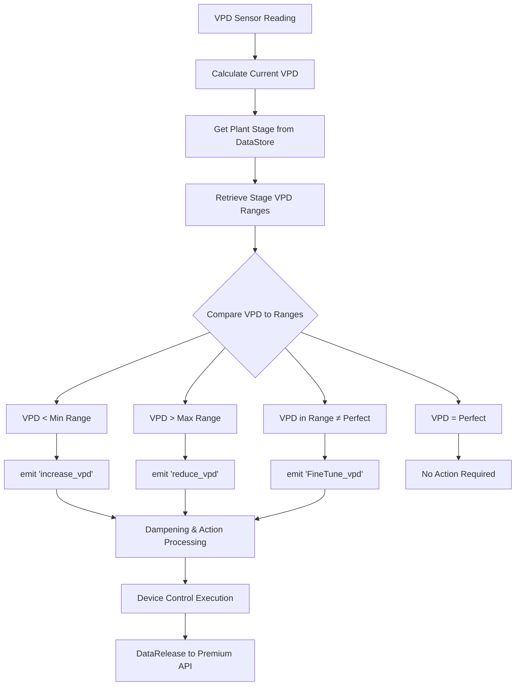
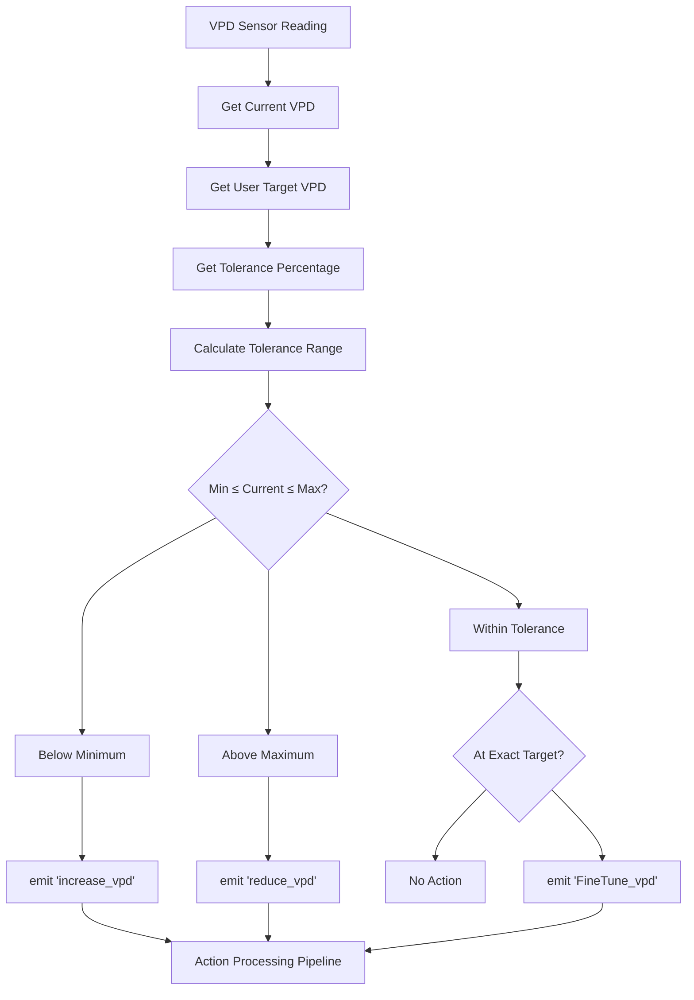
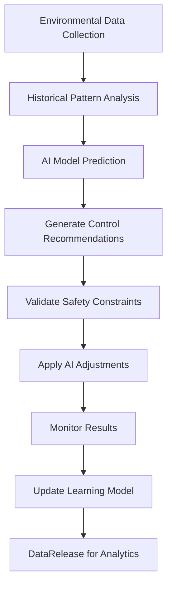

# Tent Control Modes - Complete Implementation Guide

## Overview

The OpenGrowBox system operates under different **tentMode** configurations that determine the primary control logic and automation behavior. Each mode provides different levels of automation, from manual control to advanced AI-driven optimization.

## TentMode Options

### 1. VPD Perfection Mode

**Primary automated mode for optimal plant growth**

#### When Active
- **Trigger**: `tentMode = "VPD Perfection"`
- **Logic**: Maintains optimal VPD ranges based on plant growth stages
- **Automation Level**: High - continuous environmental adaptation

#### Implementation Flow



#### Key Code Implementation

```python
# OGBModeManager.handle_vpd_perfection()
async def handle_vpd_perfection(self):
    """VPD Perfection mode - maintain optimal ranges for plant stage."""

    # Retrieve current environmental values
    currentVPD = self.data_store.getDeep("vpd.current")
    plant_stage = self.data_store.get("plantStage")

    # Get stage-specific VPD targets (from plantStages datastore)
    perfectionVPD = self.data_store.getDeep("vpd.perfection")      # Target VPD
    perfectionMinVPD = self.data_store.getDeep("vpd.perfectMin")   # Minimum acceptable
    perfectionMaxVPD = self.data_store.getDeep("vpd.perfectMax")   # Maximum acceptable

    # Validate data availability
    if any(val is None for val in [currentVPD, perfectionMinVPD, perfectionMaxVPD, perfectionVPD]):
        _LOGGER.warning(f"{self.room}: VPD values not initialized. Skipping control.")
        return

    # Determine action based on VPD position
    capabilities = self.data_store.getDeep("capabilities")

    if currentVPD < perfectionMinVPD:
        await self.event_manager.emit("increase_vpd", capabilities)
    elif currentVPD > perfectionMaxVPD:
        await self.event_manager.emit("reduce_vpd", capabilities)
    elif currentVPD != perfectionVPD:
        await self.event_manager.emit("FineTune_vpd", capabilities)
```

### 2. VPD Target Mode

**User-defined VPD control with tolerance bands**

#### When Active
- **Trigger**: `tentMode = "VPD Target"`
- **Logic**: Maintains user-set VPD target with configurable tolerance
- **Automation Level**: Medium-High - user-configured automation

#### Implementation Flow



#### Key Implementation

```python
# OGBModeManager.handle_targeted_vpd()
async def handle_targeted_vpd(self):
    """VPD Target mode with user-defined tolerance."""

    currentVPD_raw = self.data_store.getDeep("vpd.current")
    targetedVPD_raw = self.data_store.getDeep("vpd.targeted")  # User-set target
    tolerance_raw = self.data_store.getDeep("vpd.tolerance")   # Tolerance %

    # Validate inputs
    if any(val is None for val in [currentVPD_raw, targetedVPD_raw, tolerance_raw]):
        return

    currentVPD = float(currentVPD_raw)
    targetedVPD = float(targetedVPD_raw)
    tolerance_percent = float(tolerance_raw)

    # Calculate tolerance range
    tolerance_value = targetedVPD * (tolerance_percent / 100)
    min_vpd = targetedVPD - tolerance_value
    max_vpd = targetedVPD + tolerance_value

    capabilities = self.data_store.getDeep("capabilities")

    if currentVPD < min_vpd:
        await self.event_manager.emit("increase_vpd", capabilities)
    elif currentVPD > max_vpd:
        await self.event_manager.emit("reduce_vpd", capabilities)
    elif currentVPD != targetedVPD:
        await self.event_manager.emit("FineTune_vpd", capabilities)
```

### 3. Drying Mode

**Specialized mode for harvest drying and curing**

#### When Active
- **Trigger**: `tentMode = "Drying"`
- **Logic**: Environmental control optimized for post-harvest processing
- **Automation Level**: High - specialized drying algorithms

#### Drying Mode Variants

#### 3.1 ElClassico Drying
```python
async def handle_ElClassico(self, phaseConfig):
    """Traditional drying with gradual environmental changes."""

    # Phase-based temperature and humidity targets
    days_elapsed = self.get_days_into_drying()

    if days_elapsed < 3:
        # Phase 1: High humidity drying
        target_temp, target_hum = 20, 60
    elif days_elapsed < 7:
        # Phase 2: Medium humidity drying
        target_temp, target_hum = 18, 55
    else:
        # Phase 3: Low humidity curing
        target_temp, target_hum = 16, 50

    await self.apply_drying_conditions(target_temp, target_hum)
```

#### 3.2 DewBased Drying
```python
async def handle_DewBased(self, phaseConfig):
    """Dew point depression-based drying control."""

    current_temp = self.get_current_temperature()
    current_dew = self.get_current_dewpoint()
    dew_depression = current_temp - current_dew

    target_depression = phaseConfig.get("targetDewDepression", 7)

    if dew_depression < target_depression:
        # Increase temperature or decrease humidity
        await self.adjust_dew_depression_up()
    elif dew_depression > target_depression:
        # Decrease temperature or increase humidity
        await self.adjust_dew_depression_down()
```

#### 3.3 5DayDry Mode
```python
async def handle_5DayDry(self, phaseConfig):
    """Accelerated 5-day drying schedule."""

    day = min(self.get_days_into_drying() + 1, 5)

    day_targets = {
        1: {"temp": 22, "hum": 65, "vent": "low"},
        2: {"temp": 20, "hum": 60, "vent": "medium"},
        3: {"temp": 18, "hum": 55, "vent": "medium"},
        4: {"temp": 16, "hum": 50, "vent": "high"},
        5: {"temp": 14, "hum": 45, "vent": "high"}
    }

    targets = day_targets.get(day, day_targets[5])
    await self.apply_day_targets(targets)
```

### 4. AI Control Mode (Premium)

**Machine learning-driven environmental optimization**

#### When Active
- **Trigger**: `tentMode = "AI Control"`
- **Logic**: AI algorithms analyze patterns and predict optimal conditions
- **Automation Level**: Maximum - continuous learning and adaptation

#### Implementation Flow



#### Key Implementation

```python
async def handle_premium_modes(self, data):
    """Handle premium AI control modes."""

    if not self.premium_manager or not self.premium_manager.is_logged_in:
        # Fallback to VPD Perfection
        await self.handle_vpd_perfection()
        return

    controller_type = data.get("controllerType", "AI")

    if controller_type == "AI":
        # Send comprehensive data to Premium API
        await self.event_manager.emit("DataRelease", True)
        # Request AI control recommendations
        await self.event_manager.emit("AIActions", data)

    elif controller_type == "PID":
        await self.event_manager.emit("PIDActions", data)

    elif controller_type == "MPC":
        await self.event_manager.emit("MPCActions", data)
```

### 5. PID Control Mode (Premium)

**Proportional-Integral-Derivative feedback control**

#### Implementation

```python
class PIDController:
    """PID controller implementation."""

    def __init__(self, kp, ki, kd, setpoint):
        self.kp, self.ki, self.kd = kp, ki, kd
        self.setpoint = setpoint
        self.prev_error = 0
        self.integral = 0

    def calculate(self, current_value, dt):
        error = self.setpoint - current_value

        # P term
        p_term = self.kp * error

        # I term
        self.integral += error * dt
        i_term = self.ki * self.integral

        # D term
        derivative = (error - self.prev_error) / dt
        d_term = self.kd * derivative

        self.prev_error = error
        return p_term + i_term + d_term
```

### 6. MPC Control Mode (Premium)

**Model Predictive Control with optimization horizon**

#### Implementation

```python
async def handle_mpc_mode(self):
    """Model Predictive Control implementation."""

    # Define prediction horizon
    horizon = 12  # Future time steps

    # Get current system state
    current_state = self.get_system_state()

    # Predict future conditions
    predictions = await self.predict_future_conditions(horizon)

    # Optimize control trajectory
    optimal_trajectory = await self.optimize_trajectory(current_state, predictions)

    # Apply first control step
    await self.apply_control_step(optimal_trajectory[0])
```

### 7. Disabled Mode

**Safety mode with all automation disabled**

#### When Active
- **Trigger**: `tentMode = "Disabled"`
- **Logic**: No automatic environmental control
- **Automation Level**: None - manual operation only

#### Implementation

```python
async def handle_disabled_mode(self):
    """Disabled mode - manual control only."""

    # Log mode status
    await self.event_manager.emit(
        "LogForClient",
        {"Name": self.room, "Mode": "Disabled"}
    )

    # Ensure no automated actions are taken
    # System operates in manual mode only
    return None
```

## Mode Selection and Validation

### Mode Transition Logic

```python
async def selectActionMode(self, Publication):
    """Route mode execution based on tentMode."""

    controlOption = self.data_store.get("mainControl")
    if controlOption not in ["HomeAssistant", "Premium"]:
        return False

    tentMode = Publication.currentMode if hasattr(Publication, 'currentMode') else None

    mode_handlers = {
        "VPD Perfection": self.handle_vpd_perfection,
        "VPD Target": self.handle_targeted_vpd,
        "Drying": self.handle_drying,
        "AI Control": lambda: self.handle_premium_modes({"controllerType": "AI"}),
        "PID Control": lambda: self.handle_premium_modes({"controllerType": "PID"}),
        "MPC Control": lambda: self.handle_premium_modes({"controllerType": "MPC"}),
        "Disabled": self.handle_disabled_mode,
    }

    handler = mode_handlers.get(tentMode)
    if handler:
        await handler()
    else:
        _LOGGER.debug(f"{self.name}: Unknown tentMode '{tentMode}'")
```

### Mode Compatibility Validation

```python
def validate_mode_compatibility(self, tentMode: str) -> bool:
    """Validate if selected mode is compatible with current system state."""

    # Check premium requirements
    premium_modes = ["AI Control", "PID Control", "MPC Control"]
    if tentMode in premium_modes:
        if not self.premium_manager or not self.premium_manager.is_logged_in:
            return False

    # Check sensor requirements
    if tentMode in ["VPD Perfection", "VPD Target"]:
        if not self.has_vpd_sensors():
            return False

    # Check device capabilities
    required_capabilities = self.get_mode_capabilities(tentMode)
    if not self.has_required_capabilities(required_capabilities):
        return False

    return True
```

## Configuration and DataStore Integration

### tentMode Storage

```python
# DataStore structure for tentMode
tent_mode_config = {
    "tentMode": "VPD Perfection",  # Current active mode

    # VPD Perfection mode data
    "vpd": {
        "current": 1.2,           # Current VPD reading
        "perfection": 1.2,        # Target VPD for current stage
        "perfectMin": 1.0,        # Minimum acceptable VPD
        "perfectMax": 1.4,        # Maximum acceptable VPD
        "targeted": 1.2,          # User-set target (VPD Target mode)
        "tolerance": 10           # Tolerance percentage (VPD Target mode)
    },

    # Drying mode data
    "drying": {
        "currentDryMode": "ElClassico",
        "mode_start_time": "2025-12-24T10:00:00Z"
    },

    # Plant stage data
    "plantStage": "MidFlower",    # Current plant growth stage
    "plantStages": {              # Detailed stage configurations
        "Germination": {"vpdRange": [0.35, 0.70], ...},
        "EarlyVeg": {"vpdRange": [0.60, 1.20], ...},
        "MidFlower": {"vpdRange": [0.90, 1.70], ...}
    }
}
```

### Premium Mode Integration

```python
# Premium subscription validation
async def validate_premium_mode_access(self, tentMode: str) -> bool:
    """Validate premium subscription for advanced modes."""

    premium_modes = ["AI Control", "PID Control", "MPC Control"]

    if tentMode not in premium_modes:
        return True  # Non-premium mode

    if not self.premium_manager:
        return False

    # Check subscription status
    subscription = await self.premium_manager.get_subscription_status()

    # Validate feature access
    if tentMode == "AI Control":
        return subscription.get("ai_controllers", False)
    elif tentMode == "PID Control":
        return subscription.get("pid_control", False)
    elif tentMode == "MPC Control":
        return subscription.get("mpc_optimization", False)

    return False
```

## Mode Performance Monitoring

### Mode Effectiveness Tracking

```python
async def track_mode_performance(self, tentMode: str):
    """Track performance metrics for active mode."""

    performance_data = {
        "mode": tentMode,
        "timestamp": datetime.now().isoformat(),
        "vpd_stability": self.calculate_vpd_stability(),
        "environmental_control": self.assess_environmental_control(),
        "energy_efficiency": self.calculate_energy_efficiency(),
        "user_satisfaction": self.get_user_feedback_score()
    }

    # Store performance data
    await self.store_performance_metrics(performance_data)

    # Trigger mode optimization if needed
    if self.should_optimize_mode(performance_data):
        await self.suggest_mode_optimization(tentMode, performance_data)
```

### Automatic Mode Switching

```python
async def evaluate_mode_switching(self):
    """Evaluate if mode switching would improve performance."""

    current_mode = self.data_store.get("tentMode")
    current_performance = self.get_current_performance_metrics()

    # Evaluate alternative modes
    alternative_modes = self.get_available_modes()

    best_alternative = None
    best_score = current_performance["overall_score"]

    for mode in alternative_modes:
        if mode != current_mode and self.validate_mode_compatibility(mode):
            predicted_performance = await self.predict_mode_performance(mode)
            if predicted_performance["overall_score"] > best_score:
                best_alternative = mode
                best_score = predicted_performance["overall_score"]

    # Switch to better performing mode
    if best_alternative:
        await self.initiate_mode_switch(best_alternative, "performance_optimization")
```

---

**Last Updated**: December 24, 2025
**Version**: 2.1 (Complete tentMode Documentation)
**Status**: Production Ready