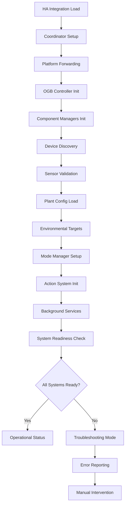

# OpenGrowBox Initialization and Startup

## Overview

This document describes the complete initialization sequence of the OpenGrowBox HA Integration, from Home Assistant startup through full operational status.

## Startup Sequence

### Phase 1: Home Assistant Integration Loading

#### 1.1 Integration Discovery
```python
# __init__.py - async_setup_entry()
async def async_setup_entry(hass: HomeAssistant, entry: ConfigEntry) -> bool:
    """Set up OpenGrowBox from a config entry."""

    # Initialize coordinator for data management
    coordinator = OGBDataCoordinator(hass, entry)

    # Fetch initial data
    await coordinator.async_config_entry_first_refresh()

    # Store coordinator for platform access
    hass.data.setdefault(DOMAIN, {})
    hass.data[DOMAIN][entry.entry_id] = coordinator

    # Forward setup to all platforms
    await hass.config_entries.async_forward_entry_setups(entry, PLATFORMS)

    # Register services
    await async_register_services(hass)

    return True
```

#### 1.2 Platform Initialization
The integration forwards setup to these platforms:
- **Sensor**: Environmental monitoring sensors
- **Switch**: Device control switches
- **Select**: Mode and configuration selectors
- **Climate**: HVAC climate control
- **Number**: Adjustable parameters

### Phase 2: Core System Initialization

#### 2.1 OGB Controller Setup
```python
# OGB.__init__() - Main controller initialization
def __init__(self, hass, config_entry, data_store_manager):
    """Initialize OpenGrowBox controller."""

    # Core components
    self.hass = hass
    self.config_entry = config_entry
    self.data_store_manager = data_store_manager

    # Initialize event system
    self.event_manager = OGBEventManager()

    # Setup backwards compatibility
    self._setup_backwards_compatibility()

    # Initialize managers
    self.main_controller = OGBMainController(hass, data_store_manager, self.event_manager)

    # Start initialization
    asyncio.create_task(self._initialize_system())
```

#### 2.2 Component Initialization Order
1. **DataStore Manager**: Persistent data storage
2. **Event Manager**: Inter-component communication
3. **Device Manager**: Hardware device coordination
4. **Mode Manager**: Control logic coordination
5. **Action Manager**: Device command execution
6. **Specialized Managers**: VPD, crop steering, hydroponics

### Phase 3: Device and Sensor Discovery

#### 3.1 Hardware Device Detection
```python
# OGBDeviceManager.__init__()
async def initialize_devices(self):
    """Discover and initialize all connected devices."""

    # Scan for configured devices
    configured_devices = self.data_store.get("devices") or []

    for device_config in configured_devices:
        try:
            # Create device instance
            device = self._create_device_instance(device_config)

            # Initialize device
            await device.initialize()

            # Register with event system
            self.event_manager.on(f"Device_{device.name}_Update", device.handle_update)

            # Add to active devices
            self.devices[device.name] = device

        except Exception as e:
            _LOGGER.error(f"Failed to initialize device {device_config.get('name')}: {e}")
```

#### 3.2 Sensor Validation and Calibration
```python
# OGBSensorValidationManager.initialize_sensors()
async def initialize_sensors(self):
    """Initialize and validate all sensor readings."""

    sensors = self.data_store.get("sensors") or {}

    for context, sensor_groups in sensors.items():
        for sensor_type, sensor_list in sensor_groups.items():
            for sensor in sensor_list:
                # Validate sensor configuration
                if not self._validate_sensor_config(sensor):
                    _LOGGER.warning(f"Invalid sensor config: {sensor}")
                    continue

                # Initialize sensor reading tracking
                self.sensor_history[sensor["entity_id"]] = []

                # Schedule initial calibration if needed
                if sensor.get("needs_calibration", False):
                    await self.schedule_sensor_calibration(sensor)
```

### Phase 4: Plant and Environmental Setup

#### 4.1 Plant Configuration Loading
```python
# Load plant-specific settings
async def load_plant_configuration(self):
    """Load plant type and stage configuration."""

    plant_config = self.data_store.get("plantConfig") or {}

    # Set plant type
    plant_type = plant_config.get("type", "Cannabis")
    self.data_store.set("plantType", plant_type)

    # Set plant stage
    plant_stage = plant_config.get("stage", "Germination")
    await self.set_plant_stage(plant_stage)

    # Load plant-specific parameters
    await self.load_plant_parameters(plant_type)
```

#### 4.2 Environmental Target Initialization
```python
# Set environmental targets based on plant stage
async def initialize_environmental_targets(self):
    """Set initial environmental targets from plant stages."""

    plant_stage = self.data_store.get("plantStage")
    plant_type = self.data_store.get("plantType")

    # Get targets from plantStages datastore
    stage_data = self.data_store.getDeep(f"plantStages.{plant_stage}")

    if stage_data:
        # Set temperature targets
        self.data_store.setDeep("tentData.maxTemp", stage_data.get("maxTemp", 25))
        self.data_store.setDeep("tentData.minTemp", stage_data.get("minTemp", 20))

        # Set humidity targets
        self.data_store.setDeep("tentData.maxHumidity", stage_data.get("maxHumidity", 70))
        self.data_store.setDeep("tentData.minHumidity", stage_data.get("minHumidity", 50))

    # Initialize VPD targets
    await self._plant_stage_to_vpd(plant_stage)
```

### Phase 5: Control System Activation

#### 5.1 Mode Manager Startup
```python
# OGBModeManager.initialize()
async def initialize(self):
    """Initialize mode management system."""

    # Set initial mode
    initial_mode = self.data_store.get("tentMode") or "VPD Perfection"
    self.currentMode = initial_mode

    # Initialize specialized managers
    self.CropSteeringManager = OGBCSManager(self.hass, self.data_store, self.event_manager, self.room)
    self.aiDataBridge = OGBAIDataBridge(self.hass, self.event_manager, self.data_store, self.room)

    # Register event handlers
    self.event_manager.on("selectActionMode", self.selectActionMode)

    _LOGGER.info(f"Mode Manager initialized in {self.room} with mode: {initial_mode}")
```

#### 5.2 Action System Activation
```python
# OGBActionManager.initialize()
async def initialize(self):
    """Initialize action execution system."""

    # Set up device capabilities mapping
    self.capabilities = await self._load_device_capabilities()

    # Initialize action history
    self.actionHistory = {}

    # Set up dampening parameters
    self.defaultCooldownMinutes = {
        "canExhaust": 2,
        "canHumidify": 3,
        "canHeat": 5,
        "canCool": 5,
        "canLight": 1
    }

    # Register event handlers
    self.event_manager.on("increase_vpd", self._handle_increase_vpd)
    self.event_manager.on("reduce_vpd", self._handle_reduce_vpd)
    self.event_manager.on("FineTune_vpd", self._handle_fine_tune_vpd)
```

### Phase 6: Monitoring and Background Tasks

#### 6.1 Sensor Monitoring Loop
```python
# OGBVPDManager.start_monitoring()
async def start_monitoring(self):
    """Start continuous sensor monitoring."""

    self._monitoring_active = True

    while self._monitoring_active:
        try:
            # Trigger VPD data collection
            await self.handle_new_vpd(None)

            # Wait for next monitoring interval
            await asyncio.sleep(self.monitoring_interval)

        except Exception as e:
            _LOGGER.error(f"VPD monitoring error: {e}")
            await asyncio.sleep(30)  # Brief pause on error
```

#### 6.2 Background Service Tasks
```python
# Start all background services
async def start_background_services(self):
    """Start all background monitoring and maintenance tasks."""

    tasks = []

    # Data cleanup service
    if self.data_cleanup_manager:
        tasks.append(self.data_cleanup_manager.start_cleanup())

    # Premium analytics (if enabled)
    if self.premium_manager and self.premium_manager.is_logged_in:
        tasks.append(self.premium_manager.start_analytics_collection())

    # Notification system
    if self.notification_manager:
        tasks.append(self.notification_manager.start_notification_service())

    # Device health monitoring
    tasks.append(self.device_manager.start_health_monitoring())

    # Wait for all services to start
    await asyncio.gather(*tasks, return_exceptions=True)

    _LOGGER.info(f"All background services started for {self.room}")
```

### Phase 7: System Health Verification

#### 7.1 Readiness Checks
```python
# OGBMainController.verify_system_readiness()
async def verify_system_readiness(self) -> Dict[str, Any]:
    """Verify all system components are ready for operation."""

    readiness_status = {
        "data_store": False,
        "devices": False,
        "sensors": False,
        "managers": False,
        "monitoring": False,
        "overall_ready": False
    }

    # Check data store
    readiness_status["data_store"] = await self._check_data_store_readiness()

    # Check devices
    readiness_status["devices"] = await self._check_device_readiness()

    # Check sensors
    readiness_status["sensors"] = await self._check_sensor_readiness()

    # Check managers
    readiness_status["managers"] = await self._check_manager_readiness()

    # Check monitoring
    readiness_status["monitoring"] = await self._check_monitoring_readiness()

    # Overall readiness
    readiness_status["overall_ready"] = all(readiness_status.values())

    return readiness_status
```

#### 7.2 Operational Status Report
```python
# Generate initialization completion report
async def generate_startup_report(self) -> Dict[str, Any]:
    """Generate comprehensive startup status report."""

    startup_report = {
        "timestamp": datetime.now().isoformat(),
        "system_status": "operational",
        "components_initialized": [],
        "warnings": [],
        "errors": [],
        "performance_metrics": {}
    }

    # Check each component
    components = ["data_store", "event_manager", "device_manager", "mode_manager", "action_manager"]

    for component in components:
        status = await self._check_component_status(component)
        if status["operational"]:
            startup_report["components_initialized"].append(component)
        else:
            startup_report["errors"].append(f"{component}: {status['error']}")

    # Performance metrics
    startup_report["performance_metrics"] = {
        "initialization_time": self._calculate_initialization_time(),
        "memory_usage": self._get_memory_usage(),
        "active_devices": len(self.device_manager.devices),
        "configured_sensors": len(self.data_store.get("sensors", {}))
    }

    return startup_report
```

## Initialization Flow Diagram



## Initialization Time Estimates

### Typical Startup Times
- **Basic Setup**: 30-60 seconds
- **Device Discovery**: 10-30 seconds per device
- **Sensor Calibration**: 5-15 seconds per sensor
- **Manager Initialization**: 5-10 seconds
- **Total**: 1-3 minutes for full system

### Performance Factors
- **Network Latency**: Affects device discovery
- **Device Count**: More devices = longer initialization
- **Sensor Calibration**: Required calibrations add time
- **Premium Features**: Additional services to start

## Error Handling and Recovery

### Initialization Failure Recovery
```python
async def handle_initialization_failure(self, component: str, error: Exception):
    """Handle component initialization failures."""

    _LOGGER.error(f"Failed to initialize {component}: {error}")

    # Attempt recovery based on component
    if component == "device_manager":
        await self._recover_device_initialization()
    elif component == "sensor_validation":
        await self._recover_sensor_initialization()
    elif component == "mode_manager":
        await self._fallback_mode_initialization()

    # Continue with partial functionality if possible
    await self._enable_partial_operation_mode()
```

### Graceful Degradation
```python
async def enable_partial_operation_mode(self):
    """Enable system operation with failed components."""

    # Identify working components
    working_components = await self._identify_working_components()

    # Configure fallback operation
    if "basic_monitoring" in working_components:
        await self._enable_basic_monitoring_mode()
    elif "manual_control" in working_components:
        await self._enable_manual_control_mode()
    else:
        await self._enable_safety_shutdown_mode()
```

## Configuration Validation

### Startup Configuration Checks
```python
async def validate_startup_configuration(self) -> List[str]:
    """Validate configuration before full initialization."""

    validation_errors = []

    # Check required configuration
    if not self.config_entry.data.get("host"):
        validation_errors.append("Controller host not configured")

    if not self.data_store.get("plantConfig"):
        validation_errors.append("Plant configuration missing")

    # Check device configuration
    devices = self.data_store.get("devices") or []
    if not devices:
        validation_errors.append("No devices configured")

    # Check sensor configuration
    sensors = self.data_store.get("sensors") or {}
    if not sensors:
        validation_errors.append("No sensors configured")

    return validation_errors
```

## Monitoring and Health Checks

### Continuous Health Monitoring
```python
async def start_health_monitoring(self):
    """Start continuous system health monitoring."""

    while True:
        try:
            # Component health checks
            health_status = await self.check_system_health()

            # Alert on issues
            if not health_status["overall_healthy"]:
                await self._handle_health_issues(health_status)

            # Performance monitoring
            await self._monitor_performance_metrics()

            await asyncio.sleep(300)  # Check every 5 minutes

        except Exception as e:
            _LOGGER.error(f"Health monitoring error: {e}")
            await asyncio.sleep(60)  # Brief pause on error
```

### Performance Optimization
```python
async def optimize_initialization_performance(self):
    """Optimize initialization for faster startup."""

    # Parallel initialization where possible
    init_tasks = [
        self._initialize_devices_parallel(),
        self._initialize_sensors_parallel(),
        self._initialize_managers_parallel()
    ]

    # Execute in parallel
    await asyncio.gather(*init_tasks, return_exceptions=True)

    # Sequential initialization for dependent components
    await self._initialize_dependent_components()
```

## Troubleshooting Initialization

### Common Initialization Issues

#### Slow Startup
**Cause**: Network latency, device count, calibration requirements
**Solution**: Check network connectivity, reduce device count, skip non-essential calibrations

#### Device Connection Failures
**Cause**: Network issues, incorrect IP/configuration
**Solution**: Verify network settings, check device power, validate credentials

#### Sensor Validation Errors
**Cause**: Incorrect sensor configuration, calibration issues
**Solution**: Recheck sensor entity IDs, run calibration wizard, verify sensor compatibility

#### Manager Initialization Failures
**Cause**: Missing dependencies, configuration errors
**Solution**: Check logs for specific errors, verify all required components are installed

### Diagnostic Tools

#### Initialization Logs
```python
# Enable detailed initialization logging
_LOGGER.info(f"Initializing {component_name}...")
_LOGGER.debug(f"Configuration: {component_config}")
_LOGGER.info(f"Successfully initialized {component_name}")
```

#### Status Endpoints
```python
# System status API
@app.get("/api/system/status")
async def get_system_status():
    return {
        "initialization_complete": self.initialization_complete,
        "components_ready": self.component_status,
        "last_initialization_time": self.last_init_time,
        "system_health": await self.get_health_status()
    }
```

---

**Initialization completed successfully!** The OpenGrowBox system is now fully operational with all components initialized and monitoring active.

**Next Steps:**
- Monitor system performance in the first 24 hours
- Review and adjust environmental targets as needed
- Set up automated maintenance schedules
- Enable premium features if applicable