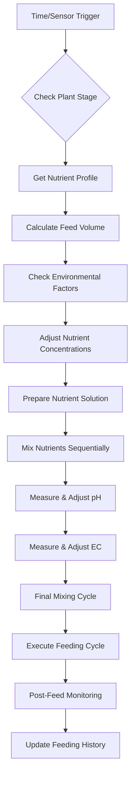

# Hydroponic Feeding System Modes - Detailed Implementation

## Overview

The OpenGrowBox Hydroponic Feeding System provides multiple operational modes with sophisticated nutrient delivery, pH/EC control, and environmental adaptation. Each mode offers different levels of automation and control complexity.

## Hydroponic Feeding Modes

### 1. Hydro Mode (Full Automation)

**Purpose**: Complete automated hydroponic nutrient delivery with environmental adaptation.

#### How It Works
- **Trigger**: Time-based scheduling or sensor thresholds
- **Process**: Automated nutrient mixing, pH/EC adjustment, feeding cycles
- **Control**: Continuous monitoring and correction
- **Features**: Plant stage adaptation, environmental compensation

#### Process Flow



#### Implementation Details

```python
# OGBTankFeedManager - Hydro Mode Execution
async def execute_hydro_mode_feeding(self):
    """Execute complete hydroponic feeding cycle."""

    # 1. Get current plant configuration
    plant_stage = self.data_store.get("plantStage")
    plant_type = self.data_store.get("plantType")

    # 2. Retrieve nutrient profile for current stage
    nutrient_profile = self.get_nutrient_profile(plant_stage, plant_type)</content>
<parameter name="filePath">docs/specialized_systems/HYDRO_FEEDING_MODES.md