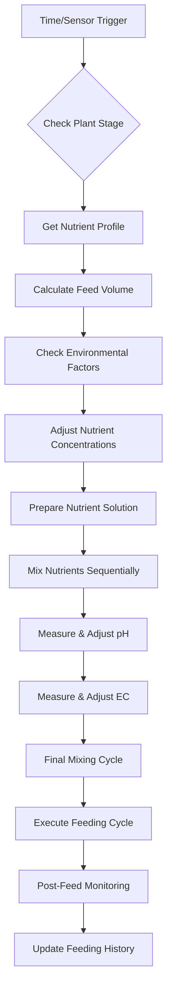

# Hydroponic Feeding System Modes - Detailed Implementation

## Overview

The OpenGrowBox Hydroponic Feeding System provides **proportional dosing modes** with intelligent nutrient delivery, pH/EC control, and environmental adaptation. The system features **small-dose adjustments** rather than large batch preparations, ensuring precise control and preventing over-fertilization.

**Key Innovation**: **Proportional Dosing** - Instead of large, infrequent nutrient batches, the system delivers calculated small doses based on real-time sensor deviations.

## Hydroponic Feeding Modes

### 1. Automatic Mode (Proportional Dosing)

**Purpose**: Intelligent automated nutrient delivery with proportional adjustments based on real-time sensor feedback.

#### How It Works
- **Trigger**: Every 10 minutes (sensor checks) + proportional dosing every 30+ minutes
- **Process**: Small-dose nutrient adjustments, pH/EC corrections based on deviations
- **Control**: Dead zone logic prevents micro-adjustments, proportional scaling for larger deviations
- **Features**: Plant stage adaptation, environmental compensation, over-fertilization prevention

#### Proportional Dosing Algorithm

```python
# Dead zone prevents unnecessary adjustments
if abs(ec_deviation) < 0.03:  # 3% EC tolerance
    no_nutrient_adjustment()

if abs(ph_deviation) < 0.1:   # 0.1 pH tolerance
    no_ph_adjustment()

# Proportional dosing for larger deviations
dose_ml = base_dose * (deviation / threshold)
dose_ml = min(dose_ml, max_safe_dose)  # Safety capping
```

#### Process Flow



#### Implementation Details

```python
# OGBTankFeedManager - Hydro Mode Execution
async def execute_hydro_mode_feeding(self):
    """Execute complete hydroponic feeding cycle."""

    # 1. Get current plant configuration
    plant_stage = self.data_store.get("plantStage")
    plant_type = self.data_store.get("plantType")

    # 2. Retrieve nutrient profile for current stage
    nutrient_profile = self.get_nutrient_profile(plant_stage, plant_type)</content>
<parameter name="filePath">docs/specialized_systems/HYDRO_FEEDING_MODES.md